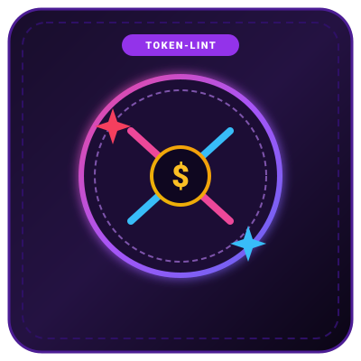

<div align="center">

# token-lint

**A static code analyzer that detects AI token waste and optimizes LLM API costs.**

<br/>



<br/><br/>

Built by [@MinoForge-Official](https://github.com/MinoForge-Official)

<br/>

[Quickstart](#quickstart) • [Cost Savings](#estimated-savings) • [Rules](#rules) • [GitHub Action](#github-actions-ci) • [CLI Flags](#cli-options)

<br/>

[](https://www.npmjs.com/package/token-lint)
[](LICENSE)
[](package.json)
[](package.json)

</div>

---

### What is this?

When building apps with LLM APIs (Gemini, OpenAI, Anthropic), small implementation details can quickly inflate your API bills:

- **Passing unpruned JSON objects into prompt templates** sends dozens of empty strings, nulls, and internal database keys that the model doesn't need.
- **Calling LLMs inside `.map()` or `for` loops** re-sends static system prompts repeatedly instead of batching.
- **Forgetting prompt cache breakpoints** on large system instructions (>350 characters) results in paying full input rates on every request.
- **Omitting `max_tokens` limits** risks runaway completions on unexpected inputs.

`token-lint` scans your source code for these anti-patterns and calculates your projected dollar savings.

It has **zero external runtime dependencies** and starts up in **under 40ms**.

---

### Table of Contents

1. [Quickstart](#quickstart)
2. [Example Output](#example-output)
3. [Estimated Savings](#estimated-savings)
4. [Rules](#rules)
5. [GitHub Actions CI](#github-actions-ci)
6. [CLI Options](#cli-options)
7. [Programmatic API](#programmatic-api)
8. [License](#license)

---

### Quickstart

Run directly with `npx`:

```bash
# Scan current directory
npx token-lint

# Scan specific folder
npx token-lint ./src

# Strict mode for CI (fails if token waste is found)
npx token-lint --strict
```

Or install globally:

```bash
npm install -g token-lint
```

---

### Example Output

```text
  Scanned: 14 source files

   ESTIMATED SAVINGS (per 10,000 API requests) 
  ┌──────────────────────────────────────────────────────────┐
  │ Wasted Tokens:   1,450,000 tokens                        │
  │ Gemini 3.8 Flash:  $1.09 saved                            │
  │ GPT-4o-mini:       $0.22 saved                            │
  │ Claude 3.7 Sonnet: $4.35 saved                            │
  └──────────────────────────────────────────────────────────┘

  Token Waste Findings (2):

  📄 src/services/recommendation.ts
     HIGH WASTE  unbatched-llm-loop :L42
        LLM API call detected inside an iterative loop.
        > const embedding = await openai.embeddings.create({ input: product.title });
        Fix: Batch multiple items into a single array prompt or use the Batch API.

  📄 src/agents/analyst.ts
     MED WASTE   unpruned-json-payload :L88
        Unpruned raw JSON serialization ("JSON.stringify(userData)") passed into prompt context.
        > const prompt = `Analyze: ${JSON.stringify(userData)}`;
        Fix: Filter null/undefined values before stringifying: (k, v) => v ?? undefined

  ─────────────────────────────────────────────────────────────────
  Found: 1 high-impact, 1 medium-impact, 0 optimizations.
```

---

### Estimated Savings

`token-lint` correlates detected anti-patterns against current API pricing models (blended input/output rates for Gemini, OpenAI, and Claude) to show you projected cost reductions per 10,000 production API calls.

---

### Rules

| Rule | Impact | Description |
| :--- | :---: | :--- |
| `unbatched-llm-loop` | High | Detects calls to `generateContent` or `chat.completions.create` within `for`, `while`, or `.map(async)` loops. |
| `missing-prompt-caching` | Medium | Flags system prompts >350 characters missing `cache_control` in Anthropic or cached content in Gemini. |
| `unpruned-json-payload` | Medium | Identifies raw `JSON.stringify()` interpolated into prompt templates without sanitization. |
| `unbounded-max-tokens` | Low | Flags model completions lacking an explicit `max_tokens` boundary. |

---

### GitHub Actions CI

To prevent costly prompt regressions, add `.github/workflows/token-lint.yml`:

```yaml
name: Token Cost Lint

on: [push, pull_request]

jobs:
  lint:
    runs-on: ubuntu-latest
    steps:
      - uses: actions/checkout@v4
      - uses: actions/setup-node@v4
        with:
          node-version: 22
      - uses: MinoForge-Official/token-lint@main
        with:
          strict: 'true'
```

---

### CLI Options

```text
Usage: token-lint [path] [options]

Arguments:
  [path]                Target directory to scan (default: current directory)

Options:
  --strict              Exit with code 1 if token waste is detected
  --json                Output results in JSON format
  --ignore <rules>      Comma-separated list of rule names to ignore
  -h, --help            Show help documentation
  -v, --version         Show current version
```

---

### Programmatic API

```typescript
import { scanCodebase } from 'token-lint';

const report = scanCodebase({ targetDir: './src' });
console.log(`Found ${report.findings.length} token leaks.`);
console.log(`Estimated Gemini Flash savings: $${report.savings.geminiFlashSavings}`);
```

---

### License

[MIT](LICENSE) © 2026 [@MinoForge-Official](https://github.com/MinoForge-Official).
